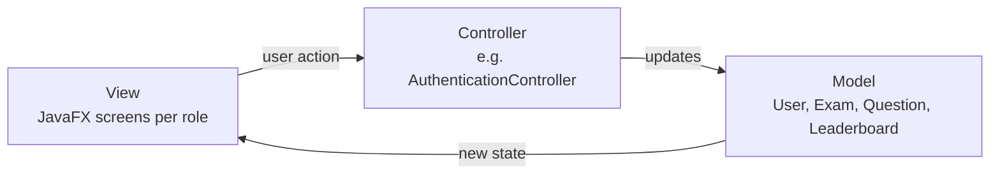
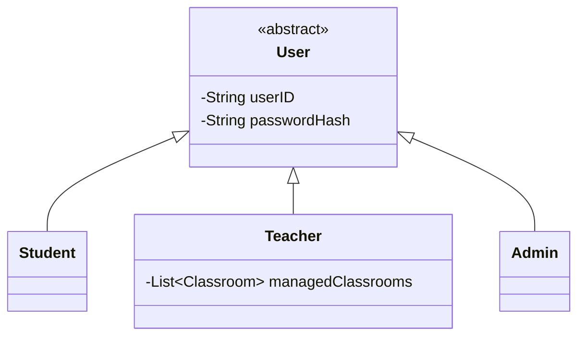

  

  

  
  
  
  

## Overview

**ExamCore** is a competitive examination platform designed to provide secure academic testing and to run exams and quizzes. The app facilitates the entire examination process from test authoring and class management for teachers to test-taking and personal performance analytics for students.

> [!NOTE]
> The UI is built for three user roles: **Students**, **Teachers**, and **Admins**, each with their own dedicated workspace.

## UI Design Goals

The main goal of the UI design is to make it as clear, visible, and easy to understand and use as possible. Our design aims to minimize clusters of useless complex elements and uses only the essential elements needed to support the required functionality of the application. We ensure that users can navigate main tasks without any effort and intuitively use the app freely.

## 1. Project and System Overview

**ExamCore** is a competitive examination platform designed to provide secure academic testing and to run exams and quizzes. The app facilitates the entire examination process from test authoring and class management for teachers to test-taking and personal performance analytics for students.

## 2. System Architecture

**ExamCore** is being developed as a database-supported desktop application using Java. The system architecture strictly adheres to the **Model-View-Controller (MVC)** design pattern to ensure a clean separation between the internal data structures, the user interface, and the interaction logic.

| Layer | Responsibility |
|---|---|
| **Model** | Contains the core business logic and represents the primary entities of the application (e.g., `Student`, `Teacher`, `Admin`, `Exam`, `Classroom`, `Leaderboard`). Responsible for data integrity, such as calculating scores and structuring the 12-week activity heatmap data. |
| **View** | Developed using Java GUI frameworks (JavaFX/Swing), the View provides distinct workspaces for the three user roles. Features modular, card-based grid layouts, persistent top navigation, and specific environments like the "Focus Mode" assessment view and the Admin verification console. |
| **Controller** | Acts as the bridge between the View and the Model. Processes user inputs — such as a student pressing "Start", a teacher adding a multiple-choice question, or an admin suspending an account — and translates these actions into data updates within the Model, then refreshes the View to reflect the changes. |

## 3. Design Pattern and Object-Oriented Structure

**ExamCore** uses an object-oriented structure based on the Model-View-Controller (MVC) design pattern. This approach keeps the core logic completely separate from the user interface. The system uses a one-way data flow: the View catches user actions, the Controller updates the Model based on those actions, and then the View refreshes to show the new state.

### System Layers

| Layer | Description |
|---|---|
| **Model Layer** | Contains all the main data and business logic (like `User`, `Exam`, `Question`, and `Leaderboard`). Manages the system's state, checks data, and does the main calculations. |
| **View Layer** | Manages the visual interface using JavaFX. Includes specific screens for different roles, like `StudentDashboardView` and `FocusModeExamView`. |
| **Controller Layer** | Acts as the middleman (like `AuthenticationController` or `ExamRunnerController`). Listens to what the user does in the View and calls the right methods in the Model. |

### Class Responsibilities

To keep the MVC structure clean and follow the **Single Responsibility Principle (SRP)**, ExamCore uses a clean hierarchy. Inheritance manages user roles efficiently: universal credentials (`userID`, `passwordHash`) are centralized in an abstract `User` class, while role-specific data (e.g., a Teacher's `managedClassrooms`) is strictly confined to subclasses.

> [!TIP]
> Because role-specific fields live only on their own subclass, adding a new role later means extending `User`, not touching existing role logic.
